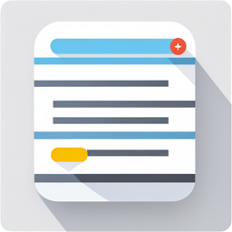

<div align="center">
<h3 align="center">Spring Todo App</h3>
</div>

[](https://github.com/chfle/spring_todo_app/graphs/commit-activity)

<!-- TABLE OF CONTENTS -->
<details open=true>
  <summary>Table of Contents</summary>
  <ol>
    <li>
      <a href="#about-the-project">About The Project</a>
      <ul>
        <li><a href="#built-with">Built With</a></li>
      </ul>
    </li>
    <li>
      <a href="#getting-started">Getting Started</a>
      <ul>
        <li><a href="#prerequisites">Prerequisites</a></li>
        <li><a href="#installation">Installation</a></li>
      </ul>
    </li>
    <li><a href="#wiki">Wiki</a></li>
    <li><a href="#roadmap">Roadmap</a></li>
    <li><a href="#contact">Contact</a></li>
  </ol>
</details>

<!-- ABOUT THE PROJECT -->

## About The Project

<p align="center">

</p>

This project is used to create and manage your To-dos

Other areas of application:

- Collaboration Features:
    - Assign users to other tasks
    - Assign multiple user to a task
    - Add comments to a task
- Time Tracking – Allow users to track the amount of time they spend on each task
- Task Prioritization – Allow users to assign a priority level to each task
- Task Reminders - Enable users to set reminders for specific tasks

### Built With

* [Spring Boot](https://spring.io/projects/spring-boot)
* [Spring Security](https://spring.io/projects/spring-security)
* [Thymeleaf](https://www.thymeleaf.org/)
* [Bootstrap](https://getbootstrap.com/docs/5.0/getting-started/introduction/)

<!-- GETTING STARTED -->

## Getting Started

### Prerequisites

* Java 17+
* Maven 3+
* Docker

### Installation

1. Clone the repo
   ```sh
   git clone git@github.com:chfle/spring_todo_app.git
   ```
2. Build Project
   ```sh
   mvn spring-boot:run

## Wiki

If you are seeking more comprehensive information about this project, including its features, functionality, and usage,
as well as insights into the development process and community involvement, then you should definitely read its
corresponding GitHub project wiki

## Roadmap

- [X] Create repo
- [X] Add Login / Register
    - [X] Add Login Page
      - [ ] Password Reset Email 
      - [ ] Password Reset Page
    - [X] Add Register Page
        - [ ] Registration Confirmation Email
    - [X] Read and Add users to the Database
    - [ ] Remember users after login
        - [x] Basic Remember-me
        - [ ] TokenRepository
- [X] Add Main Page
    - [ ] Add new tasks
    - [ ] Collaboration Features
        - [ ] Assign users to other tasks
        - [ ] Assign tasks to users
        - [ ] Assign multiple user to a task
        - [ ] Add comments to a task
        - [ ] Add comments to task
    - [ ] Remove tasks
    - [ ] Time Tracking
    - [ ] Task Prioritization
    - [ ] Task Reminders
- [X] Add Settings Page
    - [x] Change Password
    - [x] Delete Account
- [X] Add Profile Page
    - [ ] Add profile picture
      - [ ] Remove picture
      - [X] Upload picture 
    - [X] Change Profile information

<!-- CONTACT -->

## Contact

Christian
Lehnert - [@ChrLehnert](https://twitter.com/ChrLehnert) - <a href="mailto:christian.lehnert.home@protonmail.com">
christian.lehnert.home@protonmail.com</a>

<p align="right">(<a href="#top">back to top</a>)</p>
